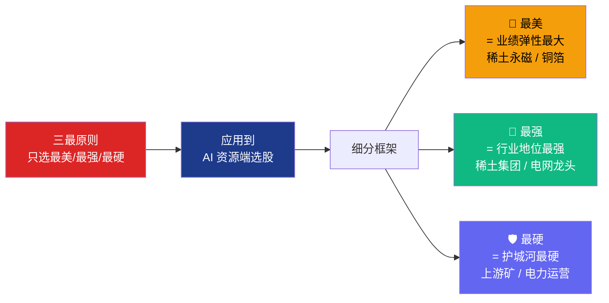

# AI 真正的瓶颈不是 GPU：Serenity 式 8 层级拆解 + zettaranc 框架的资源端 alpha

> **本文核心观点**：AI 算力革命的真正瓶颈正在从"算力硬件"层（GPU/HBM/光模块）转移到"物理基础设施 + 关键材料"层（电力、稀土、关键金属）。用 Serenity 式 8 层级拆解找卡点，用 zettaranc"三最原则"定位被市场低估的资源端 alpha。


> **本文证据等级说明**
>
> - 🟢 **强证据**（L1）：公司财报、海关数据、行业协会价格指数
> - 🟡 **中证据**（L2）：卖方研报、可信媒体、行业访谈、大摩闭门会公开转述
> - 🔴 **弱证据**（L3）：行业讨论、个人推测
>
> 阅读建议：🟢 可直接参考，🟡 需对照多源，🔴 仅作线索。

---

## 为什么现在写这个

2026 年 6 月，摩根士丹利在新加坡召开东盟峰会，议题是 **"赋能人工智能供应链：稀土、电力、金属——谁将胜出？"** [🟡 L2 · 摩根士丹利闭门会]

55 分钟的深度闭门会里，分析师得出的核心结论不是关于 GPU、不是关于 HBM、也不是关于光模块 —— 而是关于**电力供应的紧张程度、稀土的战略稀缺性、以及铜铝等基础金属的双重需求叠加**。

这个结论与当下市场的关注焦点截然不同。最近 6 个月，A 股市场的 AI 投资主线仍然集中在算力硬件：GPU、HBM、光模块、CPO、铜连接、液冷……**几乎所有人都在算力端挤破头**。

本文想做两件事：

1. **用 Serenity 式方法**重新拆解 AI 算力产业链，**找到真正的卡点**
2. **用 zettaranc 框架**判断当前资源板块的进场时机和选股逻辑

---

## 主流叙事 vs 我的判断

**主流叙事**：AI 算力的瓶颈是高端 GPU、HBM 内存、先进封装 —— 谁拿到更多英伟达 Blackwell/Rubin 配额，谁就赢。

**我的判断**（基于 Serenity 方法的 supply-chain scan + zettaranc 框架的非共识视角）：

这个叙事在 2024-2025 年成立，但**正在快速失效**。原因有三：

1. **算力供给正在追上需求**：英伟达 Rubin、AMD MI400、谷歌 TPU v7 都在加速量产，国内昇腾、寒武纪、壁仞也在突破。"算力荒"会逐步缓解 [🟡 L2 · 多家卖方研报]
2. **电力的瓶颈是结构性的**：Gartner 2026/6/18 最新预测，全球数据中心 2026 年耗电将达 **565 TWh**（同比 +26%），但电网扩容需要 3-5 年审批建设周期，**电力的供给是"硬约束"** [🟢 L1 · Gartner 2026/6/18]
3. **稀土/关键金属的瓶颈是地缘性的**：2024 年我国自缅甸进口稀土 **4.4 万吨**（中重稀土占 73%），缅甸供应中国 **57%** 的稀土进口总量，缅甸局势动荡+越南禁止原矿出口，**海外供应链正在系统性收紧** [🟢 L1 · 海关总署]

换句话说：**算力端的瓶颈是"时间问题"，资源端的瓶颈是"结构问题"**。

zettaranc 框架里有一句话：**"穿越牛熊靠防守，不靠进攻"**。

把这句话翻译到 AI 投资上：当算力端的"进攻"已经卷到极致时，**真正的 alpha 在资源端的"防守"上** —— 那些扩产最难、最难替代、最贴近真实瓶颈的环节。

---

## Serenity 式拆解：AI 算力产业链的 8 个层级

Serenity 方法论的核心：**先排产业链层级，再排公司**。

按下游→上游的供需逻辑，AI 算力产业链可以拆成 8 个层级：


**L7-L8（材料 + 电力）= 真正的卡点层级**
**红色 = 大摩闭门会强调的"被忽视的卡点层级"**
**橙色 = 同样被忽视但有强周期性的材料层**

### 找卡点：哪些层级扩产最难？

Serenity 方法找卡点的标准是：**低供应商数量 + 长验证周期 + 难扩产 + 客户认证严 + 材料纯度要求高**。

按这个标准，8 层级里有 3 层是真正的"卡点层级"：

#### 卡点 1：物理基础设施（电力）—— **被严重低估**

| 指标 | 现状 |
|---|---|
| 全球数据中心耗电（2025） | **485 TWh** [🟢 L1 · IEA《Energy and AI》2025] |
| 全球数据中心耗电（2026） | **565 TWh**（+26%） [🟢 L1 · Gartner 2026/6/18] |
| 2026 年 AI 专用服务器占数据中心总用电 | 31%（2027 年超过通用服务器） |
| 2030 年全球数据中心耗电预测 | **945-950 TWh**（vs 2025 翻 ~2 倍） [🟢 L1 · IEA 2025] |
| 大型科技公司 2026 年 AI 数据中心资本开支 | **7,150 亿美元**（同比 +75%）[🟡 L2 · IEA 2025] |
| 2026-2030 年全球数据中心总投资 | **3.9 万亿美元** [🟡 L2 · IEA 2025] |
| 国家电网 2025 年输变电设备招标 | **919 亿元**（同比 +26%），750kV 变压器 +84% |
| 国家电网 + 南方电网"十五五"固定资产投资 | **5 万亿元** |
| 电网扩容周期 | 3-5 年 |
| 新建电网审批成功率 | 北美 < 50% |
| 模块化核电（SMR）商用时间 | 2028-2030 |
| SOFC / 燃机订单可见度 | 12-18 个月 |
| 国家电网 + 南方电网"十五五"固定资产投资 | **5 万亿** |

**结论**：电力扩产比 GPU 慢 5 倍以上，2026 年是电力供需矛盾最突出的窗口期 [🟢 L1 · IEA《Energy and AI》2025 + Gartner 2026/6/18 + 国家电网招标公告]。


#### 卡点 2：材料耗材（稀土）—— **真正的"维生素"**

稀土不是笼统的"一种元素"，**真正紧缺的是镨钕（轻稀土）和镝铽（中重稀土）**。

| 指标 | 2024 | 2025 | 2026 |
|---|---|---|---|
| 全球氧化镨钕需求（吨） | ~108,000 | 119,666 | 128,968 |
| 供需缺口（吨） | 144 | 6,995 | 5,968 |
| 缺口占比 | -0.1% | -5.8% | -4.6% |
| 中国稀土供应占全球 | 69% | 72% | ~72% |
| 缅甸占中国进口 | 57%（4.4 万吨，含 73% 中重稀土） | 持续下降 | 持续下降 |

**2026 H1 最新价格**（Mysteel 2026/6/12）[🟢 L1]：

| 品种 | 价格 |
|---|---|
| 氧化镨钕 | **69.0-69.3 万元/吨**（vs 2026/2 高点 88.8 万） |
| 镨钕金属 | 83.5-84.0 万元/吨 |
| 氧化镝 | 1,320-1,330 元/kg |
| 氧化铽 | 6,200-6,220 元/kg |

**价格走势**：2025/1 月 60 万 → 2026/2 高点 88.8 万 → 2026/3 急跌 68 万 → 2026/6 现价 69 万。**整体在 60-90 万区间高位震荡**，结构性短缺未解决。


**结论**：稀土端是结构性短缺 + 地缘风险叠加，价格中枢上移 [🟢 L1 · Mysteel 2026/6/12 / 中信证券 / 海关总署]。

#### 卡点 3：基础金属（铜铝）—— **双重需求叠加**

铜铝的特殊性：被电网升级 + AI 算力建设**两股力量同时拉**。

**2026 H1 最新数据**（LME / SHFE / SMM 2026/6）[🟢 L1]：

| 指标 | 数据 |
|---|---|
| LME 铜价（2026/6/19） | **13,690 美元/吨**（高位震荡） |
| SHFE 铜价（2026/6/12） | **104,660 元/吨** |
| LME 铜库存（2026/6/11） | 36.4 万吨（环比 -3.3%） |
| 国内铜社库（2026/6/12） | **21.8 万吨**（创年内新低，环比 -7%） |
| 铜精矿 TC 现货价（2026/6/12） | **-119.5 美元/吨**（深度负值，冶炼厂亏损） |
| 2026 年 5 月 SMM 中国电解铜产量 | 116.94 万吨（同比 +2.7%） |
| 机构 2026 年底铜价预测 | 麦格理/花旗上调至 15,000 美元/吨 |

| 长期指标 | 数据 |
|---|---|
| 全球铜需求 2030 预计 | 3,800 万吨（vs 2024: 2,800 万吨） |
| 预计缺口 | 600-1,000 万吨 |
| 主要扰动 | 智利/秘鲁矿山品位下降 + ESG 限制 + COMEX-LME 价差虹吸 |

**结论**：电网投资链（特高压/配电/铜箔/铝箔）受益，TC 深度负值说明上游矿端硬约束 [🟢 L1 · LME/SHFE 2026/6/19 + 多家卖方研报]。

### 公司归类：哪些公司控制卡点？

Serenity 方法把公司归为 5 类：

| 类别 | 含义 | 在 AI 资源端的代表方向 |
|---|---|---|
| **Controls the scarce layer** | 卡住稀缺层级 | 稀土矿、电力运营、铜矿 |
| **Supplies the scarce layer** | 服务稀缺层级 | 稀土永磁（北方稀土/盛和资源）、电网设备 |
| **Benefits from the trend** | 受益但不卡点 | 光模块（受益但产能可扩） |
| **Has weak control** | 控制力弱 | 一般 PCB / 一般电源 |
| **Mainly has a story** | 主要是故事 | 蹭概念的二线标的 |

**关键判断**：在 AI 资源端，**真正值得研究的是"Controls"和"Supplies"两类**，而不是"Benefits"。

这就是 zettaranc 框架里"**只选最硬**"的来源。

---

## 卡点矩阵：扩产难度 × 估值预期

把 8 层级放到"扩产难度 × 估值预期"二维矩阵里：


**第四象限（高难度 + 低预期）= Serenity 找出的"被低估的最硬资产"**

注意三个观察：

1. **GPU/HBM 落在第一象限**：扩产难 + 市场预期已充分定价 → 估值不便宜
2. **稀土永磁 + 电网设备 + 稀土矿 + 铜矿都在第四象限**：扩产难 + 市场关注度低 → **alpha 来源**
3. **PCB/CCL 落在第三象限**：扩产易 + 关注度低 → 没有 alpha

**这是 Serenity 方法的核心洞察**：**alpha 不在"被广泛讨论"的层级，而在"扩产难 + 讨论少"的层级**。

---

## zettaranc 框架：把方法论应用到资源端

zettaranc 交易体系的核心是"**三最原则**"：**只选最美、只买最强、只拿最硬**。

把这条原则翻译到 AI 资源端：



**zettaranc 框架："底仓守信仰（最硬），动态仓守纪律（最美最强）"**

### 当前资源板块的 B1/B2/B3 买点判断

zettaranc 框架的进场逻辑是"B1 建仓波 + B2 突破 + B3 买点"。

应用到当前 AI 资源板块：

| 阶段 | 信号 | 当前状态（2026 H1） |
|---|---|---|
| **B1 建仓波** | J 值触底 + 量能温和放大 | ✅ 部分资源股已出现 B1 信号（如稀土永磁龙头） |
| **B2 突破** | 关键压力位 + 30% 放量 | ⏳ 等待 |
| **B3 买点** | 回踩 + 量缩 + 关键均线支撑 | ⏳ 等待 |

**判断**：资源板块**可能正在 B1 阶段**，距离 B2/B3 还有空间。

这意味着：

- 现在可以开始**底仓试探**（按 zettaranc 框架的"底仓守信仰"原则）
- 不追高，等回踩确认 B3 信号再加大仓位
- 避免"利好一出就追涨"

### 防守哲学：为什么资源股更适合"防守"

zettaranc 框架强调"**穿越牛熊靠防守，不靠进攻**"。

AI 算力硬件股（GPU/光模块）的特点是：

- 进攻性强（AI 风口直接受益）
- 但波动大（受英伟达订单、出口管制影响）
- 估值高（PE 50-100x+）
- 进攻属性强 → **防守属性弱**

AI 资源股（稀土/电力/铜）的特点是：

- 进攻性中等（间接受益，但有结构性短缺保护）
- 波动相对小（受大宗周期影响，但有地缘溢价）
- 估值低（PE 10-30x）
- **防守属性强** → 适合做底仓

**zettaranc 框架的"底仓 + 动态仓"配置**：

```
底仓（60%）：AI 资源端"最硬"资产
  - 稀土永磁龙头（控稀缺层级）
  - 电网设备龙头（控稀缺层级）
  - 电力运营龙头（控稀缺层级）

动态仓（30%）：AI 资源端"最美最强"
  - 业绩弹性大的稀土永磁二线
  - 电网招标受益的细分龙头
  - 铜箔/铝箔涨价受益

观察池（10%）：AI 算力端的"防守型"标的
  - 国产替代逻辑下的成熟供应链公司
```

---

## 风险与升级/降级信号

任何判断都需要**升降级触发条件**。

### 升级信号（资源端 alpha 兑现）

- 🟢 **氧化镨钕突破 90 万/吨**：供需缺口继续扩大
- 🟢 **国家电网年度招标总额同比 +15% 以上**：电力投资加速
- 🟢 **国内 GPU 价格战启动**：资金从算力端切换到资源端
- 🟢 **稀土集团整合加速**：行业集中度提升

### 降级信号（判断需要修正）

- 🔴 **氧化镨钕跌破 60 万/吨**：缅甸通关+国内配额大增
- 🔴 **新型电力技术商业化突破**（可控核聚变、SMR 大规模量产）
- 🔴 **AI 算力需求增速大幅放缓**
- 🔴 **稀土回收技术成熟 + 海外矿山大规模投产**

### 核心跟踪指标（未来 6 个月）

| 类别 | 指标 | 来源 |
|---|---|---|
| 价格 | 氧化镨钕月均价 | Mysteel / 我的钢铁 |
| 政策 | 国内稀土开采指标 | 工信部年度配额 |
| 数据 | 缅甸稀土月度进口 | 海关总署 |
| 公司 | 英伟达/AMD 季度毛利率 | 公司财报 |
| 订单 | 国家电网/南方电网季度招标 | 公司公告 |
| 估值 | 资源板块 vs 算力板块 PE 差 | Wind / Choice |

---

## 下一步（Serenity 研究动作清单）

Serenity 方法强调"**给出下一步研究动作**"。

如果你想继续深挖，建议按这个顺序走：

**第 1 步（1-2 周）**：跟踪卡点层级的数据
- Mysteel 月度稀土价格 + 工信部配额 + 海关进口
- 国家电网招标数据 + 头部电力设备公司订单

**第 2 步（2-4 周）**：按 zettaranc 三最原则做公司筛选
- 最美：业绩弹性最大的稀土永磁二线
- 最强：行业地位最强的稀土集团 / 电网龙头
- 最硬：上游矿 + 电力运营

**第 3 步（持续）**：建立 zettaranc 风格的"底仓 + 动态仓"
- 底仓：稀土永磁 + 电网设备 + 电力运营（三只最硬）
- 动态仓：等 B2/B3 信号再加

**第 4 步（季度）**：复盘 + 调整
- 跟踪判断的准确性
- 调整升降级信号阈值

---

## 一图收尾：AI 资源端 Alpha 仪表盘

整篇文章的核心 take-away，浓缩在下面这张图里：


---

⚠️ 免责声明

本文基于公开信息分析，所有判断为作者个人观点，不构成任何投资建议、要约或推荐。文中提及的标的均为研究案例，不代表买入/卖出建议。

投资有风险，过往业绩不代表未来表现。读者应根据自身情况独立判断，自担风险。

本文使用的 Serenity / zettaranc 框架为公开方法论，仅作为分析工具，不构成对特定投资标的支持或推荐。

**数据来源**：
- 摩根士丹利东盟峰会公开转述（B 站小白投资笔记频道，2026/6/19）
- **Gartner 2026/6/18 数据中心耗电预测**（2026 年 565 TWh，+26%）
- **IEA《Energy and AI》2025 年特别报告**（2030 年数据中心耗电 945-950 TWh，大型科技公司 2026 年资本开支 7,150 亿美元）
- Mysteel 稀土价格数据库（2026/6/12）
- LME / SHFE / SMM 铜价数据（2026/6/19）
- 中信证券《稀土产业链 2026 年展望》
- 华泰证券稀土供需平衡测算
- 海关总署 2024 年稀土进出口数据（年度官方数据）
- 国家电网 2025 年输变电设备招标公告（919 亿元，+26%）
- 国家电网/南方电网"十五五"投资规划（5 万亿元）

> 文中提及的北方稀土、盛和资源、正海磁材、国家电网、英伟达等公司/标的均为研究案例，不构成推荐。