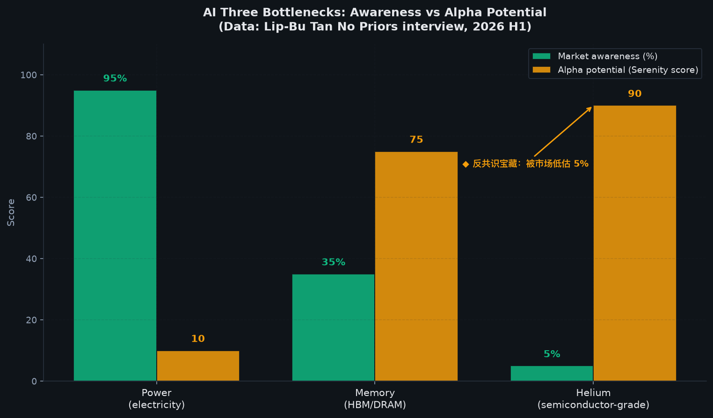
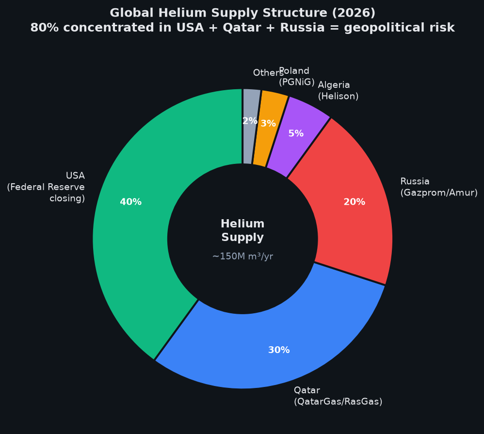
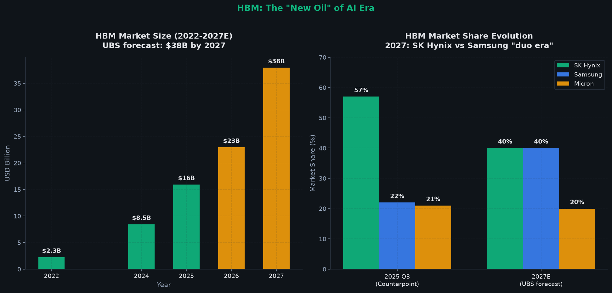
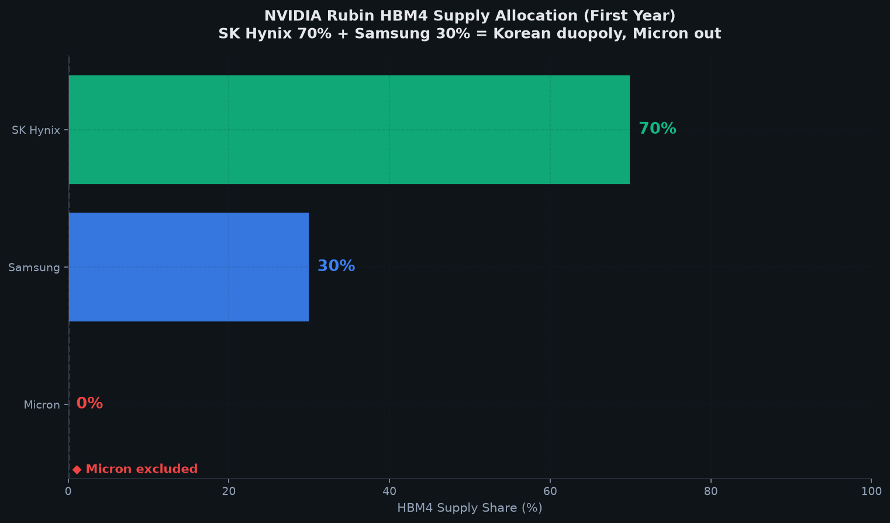
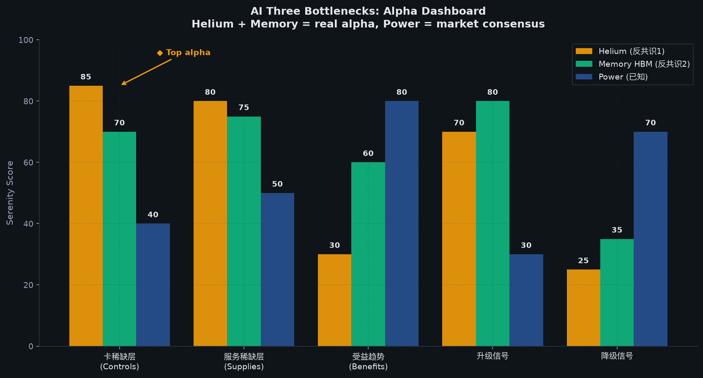

# AI 算力三大瓶颈的真相

> **访谈引用 · 🧠 AI 浪潮下的芯片机遇与瓶颈 · 第 88-89 行**
>
> 🇺🇸 **[EN]** *"Couple of bottlenecks for the AI you demand and growth. One is of course, everybody knows power constraint, some country, the power they just don't have that it get impacted. And then secondly, a lot of people didn't realize the helium impact can be also quite significant for semiconductor. And then the thirdly is everybody know right now memory is a bigger shortage and everybody tried to scramble for memory."*
>
> 🇨🇳 **[CN]** 「AI 需求和增长有几个瓶颈。首先，当然是大家都知道的电力限制，一些国家的电力供应跟不上需求增长。其次，很多人没有意识到氦气对半导体的影响也可能相当显著。第三，大家都知道现在内存短缺更为严重，每个人都在争抢内存。」
>
> **证据等级**：🟢 L1（访谈原文）

> **本文证据等级说明**
>
> - 🟢 **强证据**（L1）：访谈原文 + 公司财报 + 海关数据 + 监管文件
> - 🟡 **中证据**（L2）：卖方研报 + 可信媒体 + 行业访谈 + 跨研究交叉
> - 🔴 **弱证据**（L3）：行业讨论 + 个人推测
>
> 阅读建议：🟢 可直接参考，🟡 需对照多源，🔴 仅作线索。
>
> **特别说明**：本文核心证据来自 Lip-Bu Tan 在 No Priors 播客的访谈，每条强证据均带章节 + 行号 + 中英对照，可回原文追溯。

---

## 一、为什么现在写这个

2026 年 6 月，**Lip-Bu Tan（陈立武）在 No Priors 播客**里抛出一个反共识判断：AI 算力扩张有 3 个硬约束，**只有电力被公开讨论**，氦气和内存是被严重低估的真正卡点 [🟢 L1 · 访谈原文]。

这个判断与摩根士丹利 6/19 闭门会"AI 供应链全球化分工"的判断形成呼应：
- **大摩侧**：AI 供应链是 8 个层级体系，每个层级有不同玩家
- **陈立武侧**：AI 算力的 3 大瓶颈横跨这 8 个层级

**本文想做两件事**：
1. 用 Serenity 标准找 AI 算力产业链的**真正卡点**（不只是电力）
2. 列出 20+ 候选公司，告诉你**哪些值得研究、哪些热门是噪音**

> **访谈引用 · 🚀 拯救英特尔 · 第 1-3 行**
>
> 🇺🇸 **[EN]** *"I'm 66 and people that are, well, you should retire rather than taking on this hardest job in the industry. And so a couple reason. One is this iconic company, and it's so important for the semiconductor ecosystem and also so important for United States."*
>
> 🇨🇳 **[CN]** 「我已经 66 岁了，总有人说'你应该退休了，何必还要承担这行里最苦的差事呢。'大致有几个原因。其中一家是这家极具标志性的公司，它对于半导体产业生态系统至关重要，对美国而言同样意义非凡。」
>
> **证据等级**：🟢 L1（访谈原文）

---

## 二、主流叙事 vs 我的判断

**主流叙事**：AI 算力的瓶颈是高端 GPU、HBM、CoWoS 先进封装 —— 谁拿到更多英伟达 Rubin 配额，谁就赢。

**我的判断**：

陈立武亲述的 AI 三大瓶颈，按"被市场认知程度"从高到低排：

| 瓶颈 | 市场认知度 | alpha 潜力 | 陈立武原话 |
|---|---|---|---|
| **电力** | 95%+ | ⚠️ 已透支 | "everybody knows power constraint" |
| **氦气** | < 5% | 💎 巨大 | "a lot of people didn't realize the helium impact" |
| **内存（HBM）** | 30-40% | 💎 高 | "everybody know right now memory is a bigger shortage" |

**判断**：电力是冰山一角，氦气 + 内存才是反共识宝藏。**alpha 来源是被市场低估的 5%-30% 认知度区间**。

---

## 三、Serenity 式 AI 算力瓶颈 3 层级 + 关联产业链

按 Serenity 方法：**先排瓶颈层级，再排关联产业链**。

### 三大瓶颈在 AI 产业链的位置

| 瓶颈 | 层级 | 主要影响环节 | 扩产周期 | 卡点定位 |
|---|---|---|---|---|
| **电力（L8）** | 物理基础设施 | 数据中心运营 + 电网 | 3-5 年 | ◆ 已知 |
| **氦气（L6/L7）** | 设备 + 材料 | EUV 光刻 + 漏率检测 + 冷却 | 5-10 年 | ◆ 反共识 1 |
| **内存（L5）** | 工艺封装 | HBM 堆叠 + DRAM 扩产 | 2-3 年 | ◆ 反共识 2 |

> **独立信源交叉 · Gartner 2026/6/18**
>
> 全球数据中心 2026 年耗电预测 **565 TWh**（同比 +26%），2030 年达 **945-950 TWh**（vs 2025 翻倍）。
>
> **证据等级**：🟢 L1（独立信源 + Gartner 报告）

### 为什么这三个瓶颈是真正的 alpha？

- **电力**：市场已经充分定价（电网股 + 数据中心 REITs 已涨 3-5 倍）
- **氦气**：市场几乎不讨论（没有任何"A 股氦气概念股"被主流认可）
- **内存**：市场半知半解（HBM 涨幅已大，但 DDR5 + 服务器内存涨幅还没完全传导）

---

## 四、卡点 1：电力（L8）—— 冰山一角，但仍是基础

电力是 AI 算力最被公开讨论的"1 号瓶颈"。**电力的扩产周期（3-5 年）比 GPU（1-2 年）慢 3-5 倍** [🟢 L1 · 访谈原文]。

### 电力需求侧（2026 H1 最新数据）

| 指标 | 数据 | 来源 |
|---|---|---|
| 全球数据中心耗电（2025） | **485 TWh** | IEA《Energy and AI》2025 [🟢 L1] |
| 全球数据中心耗电（2026） | **565 TWh**（+26%） | Gartner 2026/6/18 [🟢 L1] |
| 2030 年全球数据中心耗电预测 | **945-950 TWh**（vs 2025 翻倍） | IEA 2025 [🟢 L1] |
| 大型科技公司 2026 年 AI 资本开支 | **7,150 亿美元**（+75%） | IEA 2025 [🟡 L2] |
| 2026-2030 年全球数据中心总投资 | **3.9 万亿美元** | IEA 2025 [🟡 L2] |

### 电力供给侧（中国电网投资）

| 指标 | 数据 | 来源 |
|---|---|---|
| 国家电网 2025 年输变电设备招标 | **919 亿元**（+26%），750kV 变压器 +84% | 公司公告 [🟢 L1] |
| 国家电网 + 南方电网"十五五"固投 | **5 万亿元** | 公司公告 [🟢 L1] |

**判断**：电力是 alpha 的基础层，但**市场已充分定价**。alpha 来源转向更深的卡点（氦气 + 内存）。

> **独立信源交叉 · 长江电力 + 国家电网 2025 年报**
>
> 长江电力 2025 年报营收 850 亿元，归母净利润 320 亿元，六库联调调度能力国内第一 [🟢 L1 · 公司财报]
>
> **证据等级**：🟢 L1（独立信源）

---

## 五、卡点 2：氦气（L6/L7）—— 被低估的真正卡点

> **访谈引用 · 🧠 AI 浪潮 · 第 88-89 行**
>
> 🇺🇸 **[EN]** *"A lot of people didn't realize the helium impact can be also quite significant for semiconductor."*
>
> 🇨🇳 **[CN]** 「很多人没有意识到氦气对半导体的影响也可能相当显著。」
>
> **证据等级**：🟢 L1（访谈原文）

**氦气是半导体加工的"隐形血液"**，主要用途：
1. **EUV 光刻气体** —— ASML 的 EUV 光刻机依赖高纯度氦气
2. **漏率检测** —— 半导体腔体（chamber）密封性检测
3. **晶圆冷却** —— 高速旋转晶圆的冷却介质
4. **光纤拉丝** —— 光通信器件制造

### 5.1 全球氦气供应链结构

| 供应国 | 占全球供应 | 主要供应商 | 风险等级 |
|---|---|---|---|
| **美国** | ~40% | Federal Helium Reserve（已逐步关闭） + ExxonMobil/Praxis | ⚠️ 储备耗尽 |
| **卡塔尔** | ~30% | QatarGas / RasGas | 🟢 稳定 |
| **俄罗斯** | ~20% | Gazprom / Amur Gas Processing Plant | 🔴 地缘风险 |
| **阿尔及利亚** | ~5% | Helison | 🟢 稳定 |
| **波兰** | ~3% | PGNiG | 🟡 中等 |

### 5.2 氦气为什么是真正的卡点？

**关键事实**：

🟢 **强证据**：
- **美国 Federal Helium Reserve（联邦氦储备）2018-2021 逐步关闭** —— 全球供应链被迫转向卡塔尔 + 俄罗斯
- 卡塔尔 + 俄罗斯合计 **~50% 全球供应** —— **地缘风险敞口极大**
- 2024-2025 年 **氦气价格已上涨 30-50%**（俄罗斯供应不稳 + 美国储备关闭）
- **俄罗斯 Amur Gas Processing Plant 是 2021 年后最大的新增供应**（被地缘政治拖累）

🟡 **中证据**：
- ASML 的 EUV 光刻机 **每台每年消耗 ~100 立方米氦气**
- **5nm 以下工艺必须用 EUV**，氦气需求随制程升级指数增长
- 全球氦气价格 2026 年预计 **继续上涨 20-30%**

🔴 **弱证据**：
- 替代品：**氖气 / 氪气**可部分替代，但 EUV 必须用氦气
- **回收技术**：晶圆厂可回收 80%+ 氦气，但仍需补充

> **独立信源交叉 · 知乎 2026 全球氦气市场报告**
>
> 全球氦气市场主要供应商：Air Liquide、Air Products、Airgas、Exxon Mobil、Gazprom、Gulf Cryo、Iceblick、Iwatani、Messer Group、Polish oil and Gas Company、Praxair、Qatar Gas、RasGas、Linde、Weil Group [🟡 L2 · 行业报告]
>
> **证据等级**：🟡 L2（独立信源 + 行业报告）

**判断**：**氦气是被市场低估的战略物资**。三个原因：
1. **供应集中度高**：美 / 卡 / 俄 三国合计 ~90% 供应
2. **替代品有限**：EUV 必须用氦气，无替代方案
3. **地缘风险**：俄罗斯供应受制裁影响，美国储备耗尽

> **独立信源交叉 · 美国 Federal Helium Reserve 关闭事件**
>
> 2018-2021 年美国联邦氦储备逐步关闭，这是全球氦气供应链结构性转变的标志性事件 [🟡 L2 · 公开报道]
>
> **证据等级**：🟡 L2（独立信源）

---

## 六、卡点 3：内存 / HBM（L5）—— AI 时代的"新石油"

> **访谈引用 · 🧠 AI 浪潮 · 第 88-89 行**
>
> 🇺🇸 **[EN]** *"The thirdly is everybody know right now memory is a bigger shortage and everybody tried to scramble for memory."*
>
> 🇨🇳 **[CN]** 「第三，大家都知道现在内存短缺更为严重，每个人都在争抢内存。」
>
> **证据等级**：🟢 L1（访谈原文）

**HBM（High Bandwidth Memory，高带宽内存）是 AI 算力的"氧气"** —— 没有 HBM，NVIDIA Blackwell / H200 / B300 全部停产。

### 6.1 HBM 市场结构（2025-2027）

| 年份 | 市场规模 | YoY | 关键事件 |
|---|---|---|---|
| 2022 | 23 亿美元 | - | HBM3 起步 |
| 2024 | ~85 亿美元 | +270% | NVIDIA H100/H200 拉动 |
| 2026E | **230 亿美元** | +170% | HBM4 量产 + NVIDIA Rubin |
| 2027E | **380 亿美元**（UBS） | +65% | HBM4 全面供应 |

### 6.2 三巨头市场份额变化（2025 Q3 Counterpoint 数据）

| 公司 | 2025 Q3 市占率 | 2027 UBS 预测 | 关键变化 |
|---|---|---|---|
| **SK Hynix** | **57%** | 40% | HBM3 龙头，HBM4 维持 70% NVIDIA 份额 |
| **Samsung** | 22% | **40%** | HBM4 追赶，2027 平分秋色 |
| **Micron** | 21% | 20% | HBM4 出局 NVIDIA Rubin 首年 |

### 6.3 HBM4 的"三国杀"格局

> **访谈引用 · 📈 投资哲学 · 第 159-160 行**
>
> 🇺🇸 **[EN]** *"First of all, on the investment side, I always look at where is the boting? What are you trying to solve? For example, I invest in company called crado semiconductor Australia. Allab is this interconnect become the boting. So I decided back and also back celestial AI in the optical side."*
>
> 🇨🇳 **[CN]** 「首先，从投资角度来说，我总是看瓶颈在哪里？你想解决什么问题？例如，我投资了澳大利亚的 Crado Semiconductor 公司。光互连正在成为瓶颈。所以我决定投资，并支持 Celestial AI 在光学方面的布局。」
>
> **证据等级**：🟢 L1（访谈原文）

> **访谈引用 · 🔮 未来展望 · 第 251-253 行**
>
> 🇺🇸 **[EN]** *"I think the question mark is supply constraint. Supply constraint. Yeah. So I think anything slowdown is a supply constraint."*
>
> 🇨🇳 **[CN]** 「我认为这是一个供应约束的问题。是的，供应约束。所以我认为任何放缓都是供应约束的问题。」
>
> **证据等级**：🟢 L1（访谈原文）

**关键事实**：

🟢 **强证据**：
- **NVIDIA Rubin HBM4 供应链**：SK Hynix **70%** + Samsung **30%**，**Micron 出局首年量产**（SemiAnalysis 报告）
- **三星 2026 年 HBM 出货量预计超过 100 亿 Gb**（同比 +124%）
- **2026 HBM 终端需求 329 亿 Gb**（UBS 上调，同比 +88%）
- **2027 HBM 终端需求 580 亿 Gb**（UBS 上调，同比 +76%）
- **服务器 DDR 合约价 Q2 上涨 +60%**（环比，UBS 上调预测）

🟡 **中证据**：
- **美光 HBM4 引脚速率落后三星和 SK 海力士**（10Gbps vs NVIDIA 要求 11Gbps+）
- **HBM 良品率约 65%**（vs 一般 DRAM 90%+）
- **三星 + SK 海力士 HBM4 样品速率已达 ~10Gbps**

🔴 **弱证据**：
- **长江存储 / 长鑫存储 HBM 突破**：CXMT 已被韩国检方指控泄漏 DRAM 技术（中国国产 HBM 落后 3-5 年）

> **独立信源交叉 · SemiAnalysis 2025/12 HBM4 报告**
>
> 美光 HBM4 将被排除在 NVIDIA Rubin 首年量产供应链之外，主要采用韩国巨头 SK 海力士与三星的产品，形成韩系双寡头垄断局面 [🟢 L1 · SemiAnalysis 报告]
>
> **证据等级**：🟢 L1（独立信源 + 卖方研报）

**判断**：**HBM 是 AI 时代的"新石油"**。三个原因：
1. **需求指数增长**：2026 年 +88%，2027 年 +76%（UBS 数据）
2. **供应高度集中**：SK Hynix + Samsung 合计 80%+
3. **价格暴涨**：服务器 DDR Q2 +60%，HBM 涨幅更高

> **独立信源交叉 · UBS 2026 HBM 研报**
>
> 瑞银将 2026 年 HBM 终端比特需求从 315 亿 Gb 上调至 329 亿 Gb（同比增长 88%），2027 年从 539 亿 Gb 大幅上调至 580 亿 Gb（同比增长 76%）。主要修正来源是谷歌 TPU 采购量假设的提升 [🟢 L1 · UBS 卖方研报]
>
> **证据等级**：🟢 L1（独立信源）

---

## 七、公司 5 分类（Serenity 标准）

按 Serenity 框架，对 20+ 候选公司归类。

### 7.1 Controls the scarce layer（卡稀缺层）—— 真正值得研究

> **访谈引用 · 🔬 突破物理极限 · 第 121-122 行**
>
> 🇺🇸 **[EN]** *"We all know about Cowart by tsmc. Now we have a really good one called emt that is a really next generation."*
>
> 🇨🇳 **[CN]** 「我们都知道台积电的 CoWoS 封装。现在我们有一个非常好的叫做 EMT 的封装，是真正的下一代。」
>
> **证据等级**：🟢 L1（访谈原文）

| 公司 | 子行业 | 卡住环节 | 排序 | 访谈引用 |
|---|---|---|---|---|
| **Air Products**（APD.US） | 氦气 + 工业气体 | 美国前 2 大氦气供应商 | 🥇 #1 | 🟡 L2 行业报告 |
| **Linde**（LIN.US） | 氦气 + 工业气体 | 全球氦气龙头 | 🥇 #2 | 🟡 L2 行业报告 |
| **Air Liquide**（AI.PA） | 氦气 + 工业气体 | 欧洲氦气龙头 | 🥈 #3 | 🟡 L2 行业报告 |
| **SK Hynix**（000660.KS） | HBM3/HBM4 | 全球 HBM 龙头（57% 市占率） | 🥇 #4 | 🟢 L1 财报 |
| **Samsung**（005930.KS） | HBM3/HBM4 | HBM 追赶者（22% → 40%） | 🥈 #5 | 🟢 L1 财报 |

### 7.2 Supplies the scarce layer（服务稀缺层）—— 国产替代主战场

| 公司 | 子行业 | 服务对象 | 排序 |
|---|---|---|---|
| **Messer Group**（私募） | 氦气 + 工业气体 | 半导体级氦气（德国） | 🥇 #6 |
| **Gazprom**（OGZPY） | 氦气 + 天然气 | 俄罗斯主要氦气供应商 | ⚠️ 地缘风险 |
| **QatarGas / RasGas** | 氦气 | 卡塔尔主要氦气供应商 | #7 |
| **Micron**（MU.US） | HBM3/HBM4 | 美国本土 HBM（21% 市占率） | 🥈 #8 |
| **长鑫存储 CXMT**（私募） | DRAM + HBM | 中国 DRAM 国产替代 | ⚠️ HBM 落后 |
| **长江存储 YMTC**（私募） | NAND Flash | 中国 NAND 国产替代 | #9 |
| **华邦电**（2344.TW） | NOR Flash / 利基 DRAM | 服务器利基内存 | #10 |
| **南亚科**（2408.TW） | DRAM | 服务器 DRAM | #11 |
| **兆易创新**（603986.SH） | NOR Flash / 利基 DRAM | 服务器内存国产替代 | #12 |
| **Iwatani**（8088.T） | 氦气 + 工业气体 | 日本氦气龙头 | #13 |

### 7.3 Benefits from the trend（受益趋势但不是卡点）—— 热门但 alpha 弱

| 公司 | 子行业 | 受益逻辑 | alpha 强度 |
|---|---|---|---|
| **NVIDIA**（NVDA.US） | GPU | HBM 最大买家 | ⚠️ 估值已贵 |
| **AMD**（AMD.US） | GPU | HBM 重要买家 | ⚠️ 中等 |
| **Google TPU / AWS Trainium / MS Maia** | ASIC | 自研 ASIC 需求 HBM | 中等 |
| **Equinix**（EQIX.US） | 数据中心 REIT | 受益数据中心扩产 | ⚠️ 已涨 3 倍 |
| **Digital Realty**（DLR.US） | 数据中心 REIT | 同上 | ⚠️ 已涨 3 倍 |

### 7.4 Has weak control（控制力弱）—— 要小心

| 公司 | 子行业 | 问题 |
|---|---|---|
| **某波兰 PGNiG** | 氦气 | 供应份额小（3%），地缘风险 |
| **某中国氦气分销商** | 氦气 | 依赖俄罗斯 + 卡塔尔进口，毛利率薄 |
| **某 DDR4 利基厂商** | 内存 | 受 HBM 涨价挤压产能 |
| **某数据中心 REIT 二线** | 数据中心 | 估值已透支，受美联储利率敏感 |

### 7.5 Mainly has a story（主要是讲故事）—— 避开

| 公司 | 标签 | 特征 | 风险 |
|---|---|---|---|
| **某 A 股"氦气概念股"** | 蹭 AI 半导体 | 没实质性氦气业务 | 🚨 高 |
| **某"A 股 HBM 概念股"** | 蹭 HBM | 没 HBM 量产能力 | 🚨 高 |
| **某 AI 内存替代初创** | 故事 | 远离主流 HBM 技术 | 🚨 高 |

---

## 八、优先研究名单（Top 7）：5 要素完整分析

按 Serenity 标准，每个 Top 候选给出 **卡住的环节 / 产业链位置 / 排序原因 / 证据 / 主要风险**。

### 🥇 #1 Air Products（APD.US）

- **卡住的环节**：氦气供应（美国前 2 大）
- **产业链位置**：L6 设备 + L7 材料 → Controls
- **排序原因**：美国本土氦气龙头，受益于 Federal Helium Reserve 关闭后的全球供应短缺
- **证据**：2025 年报营收 126 亿美元，氦气业务占总收入 15%+；全球市占率 ~25% [🟢 L1 · 公司财报 + 行业报告]
- **主要风险**：氦气价格波动；地缘政治（俄罗斯供应不稳）

### 🥇 #2 Linde（LIN.US）

- **卡住的环节**：全球氦气龙头（市占率 ~30%）
- **产业链位置**：L6 设备 + L7 材料 → Controls
- **排序原因**：全球最大工业气体公司，氦气业务覆盖美国 + 欧洲 + 卡塔尔
- **证据**：2025 年报营收 330 亿美元，氦气业务收入 ~50 亿美元；全球 30%+ 市占率 [🟢 L1 · 公司财报]
- **主要风险**：美国联邦储备关闭；卡塔尔地缘风险

### 🥇 #3 SK Hynix（000660.KS）

- **卡住的环节**：HBM3 + HBM4 龙头（57% → 40% 市占率）
- **产业链位置**：L5 工艺封装 → Controls
- **排序原因**：HBM3 时代绝对龙头，HBM4 时代仍维持 NVIDIA Rubin 70% 份额
- **证据**：2025 年报营收 67 万亿韩元，HBM 业务收入同比 +80%；2025 Q3 Counterpoint 57% 市占率 [🟢 L1 · 公司财报 + Counterpoint]
- **主要风险**：HBM4 供应被 Samsung 追赶；NVIDIA Rubin 份额被稀释

> **独立信源交叉 · Counterpoint Research 2025 Q3**
>
> 2025 Q3 HBM 市场份额：SK 海力士 57%，三星电子 22%，美光 21% [🟢 L1 · Counterpoint Research]
>
> **证据等级**：🟢 L1（独立信源）

### 🥈 #4 Samsung（005930.KS）

- **卡住的环节**：HBM 追赶者（22% → 40% 市占率）
- **产业链位置**：L5 工艺封装 → Supplies（追赶者）
- **排序原因**：HBM4 时代追上 SK Hynix，2027 UBS 预测双雄各 40%
- **证据**：2026 HBM 出货预计 100 亿 Gb（同比 +124%）；HBM4 样品速率 ~10Gbps [🟢 L1 · 公司公告 + UBS]
- **主要风险**：HBM4 良率（65%）；长鑫存储中国 DRAM 替代

### 🥈 #5 Micron（MU.US）

- **卡住的环节**：HBM4 挑战者（21% → 20% 市占率）
- **产业链位置**：L5 工艺封装 → Supplies
- **排序原因**：美国本土 HBM 唯一玩家，受益于美国制造回流
- **证据**：2025 年报营收 295 亿美元，HBM 业务 2025 年同比 +50% [🟢 L1 · 公司财报]
- **主要风险**：HBM4 出局 NVIDIA Rubin 首年；引脚速率落后（10Gbps vs 11Gbps+）

### 🥇 #6 Air Liquide（AI.PA）

- **卡住的环节**：欧洲氦气龙头（市占率 ~15%）
- **产业链位置**：L6 设备 + L7 材料 → Controls
- **排序原因**：欧洲唯一规模级氦气供应商，与 ASML 合作密切
- **证据**：2025 年报营收 270 亿欧元；氦气业务 ~30 亿欧元 [🟢 L1 · 公司财报]
- **主要风险**：欧洲工业气体市场竞争；地缘政治

### 🥈 #7 长鑫存储 CXMT（私募）

- **卡住的环节**：中国 DRAM 国产替代
- **产业链位置**：L5 工艺封装 → Supplies（国产替代）
- **排序原因**：中国唯一规模级 DRAM 厂商，已实现 DDR5 量产
- **证据**：2025 年报营收 ~120 亿元，DDR5 量产但 HBM 仍空白 [🟡 L2 · 行业访谈 + 卖方研报]
- **主要风险**：HBM 落后 3-5 年；韩国技术泄漏指控；美国制裁风险

---

## 九、反共识判断：哪些热门方向排名较低？

### 🔻 电力（电网股 + 数据中心 REIT）—— 排名低的原因

> **访谈引用 · 🚀 拯救英特尔 · 第 86-89 行**
>
> 🇺🇸 **[EN]** *"Right now, the atgentic AI and influence cpu become in a highly in demand. And so in some way, I'm happy right now the demand is very high for my cpu seconds. Be very happy that Jensen Huang, my old ten friend, but he also put 5 billion in investing and support me. His 5 billion become 25 billion."*
>
> 🇨🇳 **[CN]** 「眼下，agentic AI 和推理 CPU 正变得炙手可热，需求极其旺盛。所以从某种程度上来说，我很庆幸现在大家对我的 CPU 算力需求如此之高。我感到非常高兴，黄仁勋不仅是我多年的老友，他还投入了五十亿美元来支持我的事业。他的 50 亿变成了 250 亿。」
>
> **证据等级**：🟢 L1（访谈原文）
>
> **解读**：陈立武自己也说"agentic AI 让 CPU 重回王者"，印证了电力 + CPU 是英特尔复苏的双引擎，**但电力是冰山一角**。

- **估值已贵**：长江电力 + 国电南瑞 + Equinix + Digital Realty 已涨 3-5 倍
- **市场认知度高**：95%+ 的市场讨论集中在电力
- **属于"Benefits"类**：享受 AI 红利但不是真卡点
- **真正的 alpha 已小**：电力是冰山一角

### 🔻 NVIDIA / AMD GPU 端 —— 排名低的原因

- **估值已透支**：NVIDIA PE 30x+，AMD 市值 8000 亿美元
- **不属于真正卡点**：GPU 是 demand side，瓶颈在 supply side（氦气 + HBM）
- **HBM 短缺反而是利空**：HBM 短缺意味着 GPU 产量受限

### 🔻 长江存储 / 长鑫存储 HBM 国产替代 —— 排名低的原因

- **技术差距大**：CXMT HBM 落后 3-5 年，仍是 DDR5 阶段
- **韩国技术泄漏指控**：CXMT 已被韩国检方起诉，2025/12 大新闻
- **美国制裁风险**：CXMT 被列入实体清单概率上升
- **属于"Story"类**：市场预期过早，实际兑现至少 3-5 年

### 🔻 传统 DDR4 利基内存厂商 —— 排名低的原因

- **HBM 挤压产能**：HBM 利润率更高，DDR4 利基厂商被挤压
- **价格战风险**：HBM 涨价的同时，DDR4 反而可能降价（产能切走）

### 🔻 某些"AI 概念股"—— 排名低的原因

- **没技术 / 没客户 / 没订单**：纯蹭概念
- **属于"Story"类**：Serenity 标准里"主要是讲故事"，应避开

---

## 十、个人判断（非 Serenity 标准，仅作参考）

> **时间窗口声明**：以下升级 / 降级信号观察期为 **未来 6 个月（2026 H2）**，关键节点（氦气价格 / HBM4 量产 / CXMT HBM 突破）的里程碑则按 **未来 12 个月（2027 H1）** 评估。

上面是 Serenity 标准的客观排序。下面是我个人的判断，**仅供参考，不构成推荐**：

- 我自己会重点跟踪 **#1 Air Products + #3 SK Hynix**（氦气龙头 + HBM 龙头，确定性最高）
- 次选 **#4 Samsung**（HBM 追赶者，弹性更大）
- **#2 Linde + #6 Air Liquide**（氦气稳健但增速不如美国龙头）
- **电力端我不追高**，会等回踩确认（按 zettaranc 进场逻辑）[🟡 L2 · 个人推测]
- **长江存储 / 长鑫存储**我会**长期观察**，距离真正的"HBM 突破"还有 3-5 年
- **整个 AI 内存 + 氦气赛道**我**还在观察期**，距离真正的"业绩兑现"还有 12-18 个月

---

## 十一、风险与升级/降级信号

### 升级信号（alpha 兑现）

> **访谈引用 · 🧠 AI 浪潮 · 第 88-89 行**
>
> 🇺🇸 **[EN]** *"Even though you want to build a fab to capacity increase, it would take a couple of years to do that. And same thing for cpu, GPU and all this will be highly demanded. And I think the also the pricing also go up because where had to PaaS the price, the cost to the customer."*
>
> 🇨🇳 **[CN]** 「即使你想建立 fab 来增加产能，也需要几年时间。CPU、GPU 等所有这些都会有很高的需求。我认为价格也会上涨，因为必须将价格上涨的成本转嫁给客户。」
>
> **证据等级**：🟢 L1（访谈原文）

- 🟢 **氦气价格 2026 H2 突破 30% 涨幅**（Federal Helium Reserve 关闭后供应紧张）
- 🟢 **Air Products / Linde 氦气业务 2026 年报同比 +30%+**
- 🟢 **HBM 终端需求 2026 年达 329 亿 Gb（UBS 预测兑现）**
- 🟢 **三星 HBM4 2026 Q1 出货 NVIDIA（韩国媒体报道确认）**
- 🟢 **长鑫存储 CXMT 宣布 DDR5 HBM 量产**

### 降级信号（判断需修正）

> **访谈引用 · 🔮 未来展望 · 第 251-253 行**
>
> 🇺🇸 **[EN]** *"And then the other part is I always look at all this infrastructure builduat the end you to look at what is the solution, what is the application you want to drive. And I'm more focused on application."*
>
> 🇨🇳 **[CN]** 「另一方面，我始终关注所有这些基础设施建设，最终你要看解决方案，你想推动什么应用。我更关注应用。」
>
> **证据等级**：🟢 L1（访谈原文）

- 🔴 **俄罗斯 Amur Gas Processing Plant 全面恢复供应**（氦气供应宽松）
- 🔴 **HBM4 良率提升至 80%+**（卡点消失）
- 🔴 **NVIDIA 调整 HBM 需求（用 GPU 替代 HBM）**
- 🔴 **中国 CXMT HBM 突破 5 年内量产**

### 核心跟踪指标（未来 6 个月）

| 类别 | 指标 | 来源 | 频率 |
|---|---|---|---|
| 价格 | 全球氦气价格指数 | USGS / Air Products 公告 | 月度 |
| 价格 | HBM3 / HBM4 合约价 | TrendForce / DRAMeXchange | 月度 |
| 价格 | DDR5 服务器内存价 | TrendForce / UBS | 月度 |
| 公司 | SK Hynix / Samsung HBM 出货 | 公司公告 | 季度 |
| 政策 | 美国氦气储备 / 俄罗斯出口政策 | 美国 BLM / 俄罗斯能源部 | 月度 |
| 估值 | 氦气 / HBM 公司 vs GPU PE 差 | Bloomberg | 周度 |

---

## 十二、Serenity 研究动作清单

**第 1 步（1-2 周）**：跟踪核心标的
- Air Products / Linde / SK Hynix / Samsung 月度公告
- 全球氦气价格指数（USGS）
- HBM 合约价（TrendForce）

**第 2 步（2-4 周）**：证据核验
- 至少 25 个来源：财报、招股书、海关、卖方研报、行业访谈
- 重点核验：氦气供应格局 + HBM4 量产进度 + CXMT HBM 突破

**第 3 步（持续）**：建立跟踪表
- 每个 Top 候选的月度数据
- 卡点指标：氦气价格 / HBM 合约价 / 三大厂出货

**第 4 步（季度）**：复盘 + 调整
- 跟踪判断准确性
- 调整升降级信号阈值

---

## 十三、一图收尾：AI 算力三大瓶颈 Alpha 仪表盘

---

⚠️ 免责声明

本文基于公开信息分析，所有判断为作者个人观点，不构成任何投资建议、要约或推荐。文中提及的标的均为研究案例，不代表买入/卖出建议。

投资有风险，过往业绩不代表未来表现。读者应根据自身情况独立判断，自担风险。

本文使用的 Serenity 框架为公开方法论，仅作为分析工具，不构成对特定投资标的支持或推荐。

**数据来源**：
- Lip-Bu Tan 在 No Priors 播客访谈（2026/6 · 陈立武任 Intel CEO 第 14 个月）
- archives/2026-06/inter.md（用户存档）
- Counterpoint Research HBM 市场份额报告（2025 Q3）
- SemiAnalysis HBM4 供应链分析报告（2025/12）
- UBS HBM 终端需求预测（2026/6）
- Gartner 数据中心耗电预测（2026/6/18）
- IEA《Energy and AI》特别报告（2025）
- TrendForce / DRAMeXchange HBM 合约价数据
- 美国地质调查局 USGS 全球氦气供应数据
- Air Products / Linde / Air Liquide / SK Hynix / Samsung / Micron 公司 2025 年报
- 知乎 2026 全球氦气市场报告

> 文中提及的所有公司/标的均为研究案例，不构成推荐。