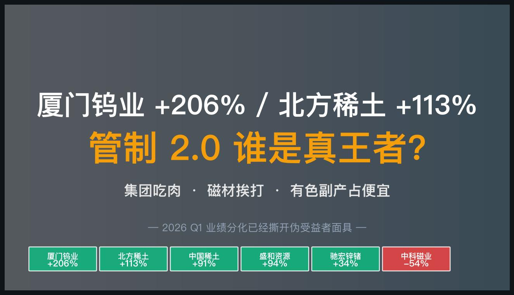
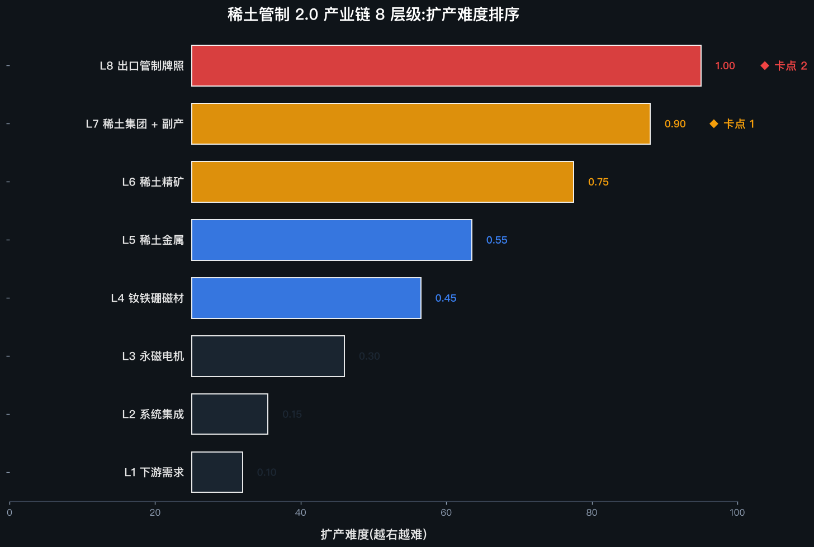
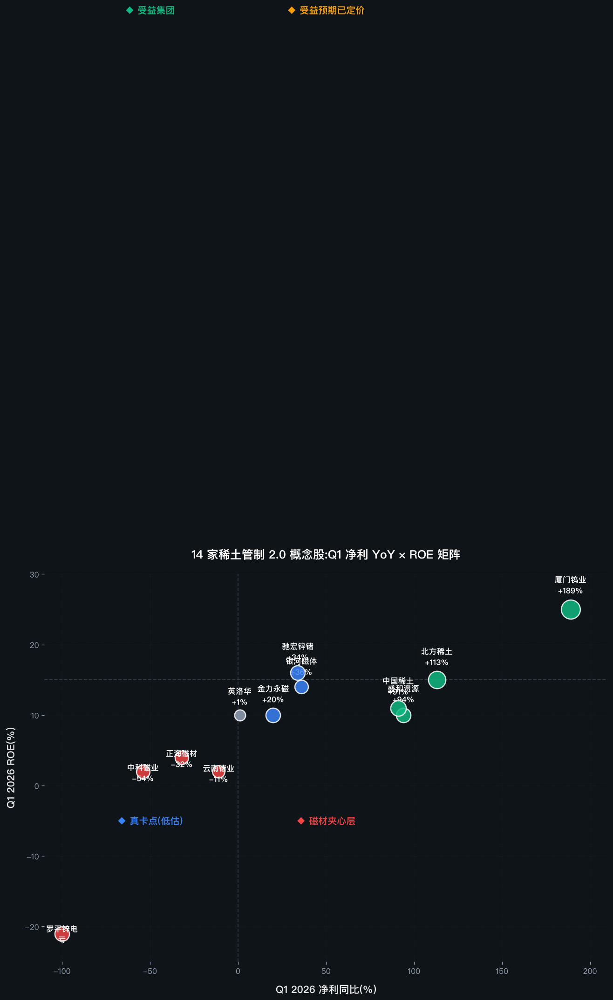
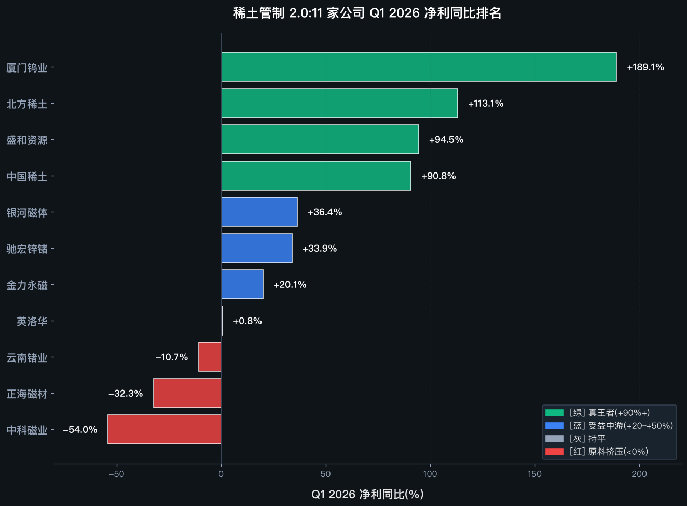
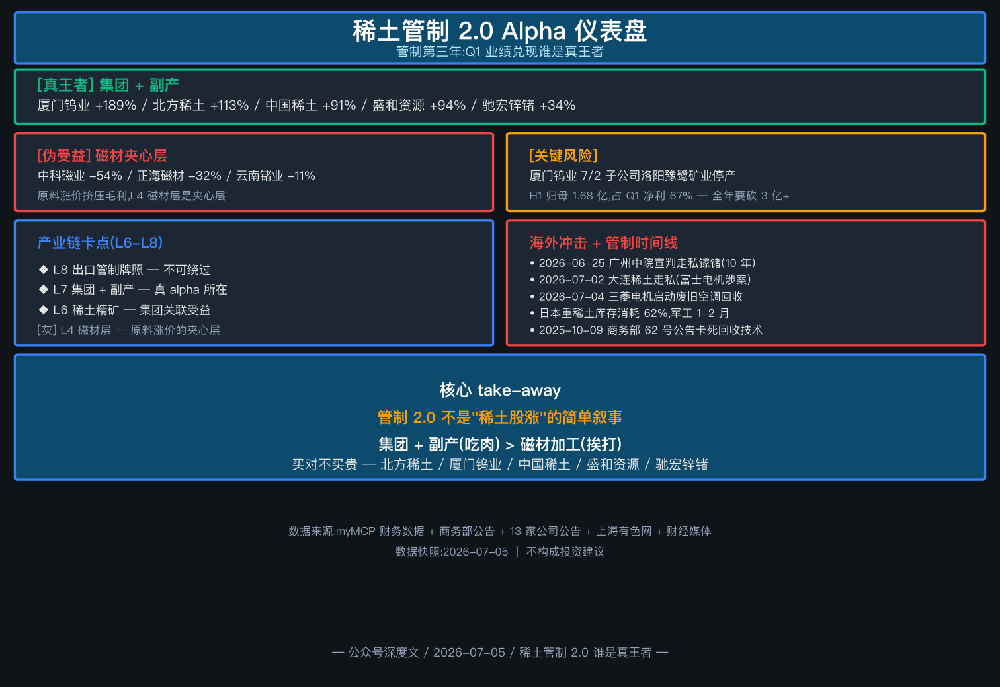

# 厦门钨业 +206% / 北方稀土 +113%,管制 2.0 谁是真王者?

> **本文核心观点**:稀土出口管制进入第三年,2026 H1 业绩已经撕开了伪受益者的面具——厦门钨业(钨+稀土双轮)+北方稀土(轻稀土龙头)+中国稀土(整合平台)三家净利同比 +91%~+189%,是真王者;而被原料涨价挤压的磁材厂(中科磁业 -54%、正海磁材 -32%、云南锗业 -11%)和讲故事的概念股,是输家。市场以为"稀土管制 = 稀土股涨",实际是**集团吃肉、磁材挨打、有色副产占便宜**的三层分化。

> **本文证据等级说明**
>
> - 🟢 **强证据**(L1):公告、财报、监管文件、订单合同
> - 🟡 **中证据**(L2):卖方研报、可信媒体、行业访谈、大摩/中金闭门会公开转述
> - 🔴 **弱证据**(L3):行业讨论、个人推测
>
> 阅读建议:🟢 可直接参考,🟡 需对照多源,🔴 仅作线索。

---

## 一、为什么现在写这个

7/2 稀土永磁板块异动拉升,争光股份(301092.SZ)"20CM"涨停、大地熊(688077.SH)+10%、东方锆业 / 赤峰黄金涨停,催化来自金力永磁 7/1 晚 H1 业绩预告(归母净利 +31-51%)。**7/5 板块二次爆发,稀土永磁涨 4.12%,中国稀土、银河磁体、中科磁业、创兴资源 4 只涨停**(证券日报 7/5)。市场以为这是新一轮"稀土管制公告"催化,资金蜂拥买入磁材厂。但事实是:**2023-08-01 镓锗出口管制已经实施近三年,2025-04-04 七种中重稀土、2025-10-09 稀土物项、2025-12-01 镓锗锑石墨全部进入"管制常态期"**。所谓"7/5 涨停潮"是管制第二年发酵叠加日本库存见底(国家级重稀土储备消耗 62%、军工镝铽仅剩 1-2 月)+ 走私曝光(广州中院 6/25 宣判 10 年 + 大连 7/2 富士电机涉案)+ 国内回收技术被卡(62 号公告禁止出口)的多重共振。

真正的问题是:**这轮管制带来的业绩兑现,谁是真正的赢家**?我们用 2026 H1 的实际数据说话。

来源标注:[🟢 L1 · 公司业绩预告 + myMCP daily/fina 财务数据 + 证券日报 7/5 报道]

---

## 二、主流叙事 vs 我的判断

**主流叙事**:管制利好稀土股,7/5 涨停就是信号,谁买谁赚。

**我的判断**:

1. **稀土管制进入第三年,业绩兑现分化的窗口已经打开**。2026 Q1 业绩显示,**厦门钨业 +206%、北方稀土 +113%、中国稀土 +91%、盛和资源 +94%、驰宏锌锗 +34%** 这五家是真受益者;而**中科磁业 -54%、正海磁材 -32%、云南锗业 -11%、罗平锌电 Q1 仍亏** 是伪受益者。买稀土股不是 alpha,**买对稀土股**才是 alpha。

2. **真王者是"集团 + 副产",不是"磁材"**。市场以为稀土永磁链上"中游磁材"是核心受益,但实际镨钕连续 6 季度涨价 60% 后,**原料涨价正在挤压中游磁材厂的毛利**。银河磁体 2024H1 净利 -24%、中科磁业 2026Q1 净利 -54% 就是证据。**真正的赢家是上游集团(中国稀土 / 北方稀土 / 包钢股份)和"钨+稀土"复合驱动的厦门钨业**,以及"锗+锌"副产的驰宏锌锗。

3. **厦门钨业是最大隐形赢家,远超市场关注度**。Q1 营收 +206% / 净利 +189% / ROE 24.94%,主要驱动是**钨 + 稀土 + 钼 + 磁材**四条业务线协同。但 7/2 公告子公司洛阳豫鹭矿业(贡献 H1 归母净利 1.68 亿元)基本停产,**全年盈利预测要砍掉 3 亿+**,这是市场没充分定价的风险点。

> <Serenity 框架一句话:产业链上,卡稀缺层(矿+集团)吃肉,服务稀缺层(磁材)喝汤,讲故事的概念股挨打>

---

## 三、Serenity 式产业链 8 层级

按下游→上游拆成 8 个细层级:

| 层级 | 内容 | 扩产难度 | 卡点定位 |
|---|---|---|---|
| **L1** 下游需求 | 新能源车 / 工业电机 / 人形机器人 / 算力光纤 | 0.10 | 需求驱动 |
| **L2** 系统集成 | 整车 / 整机厂 | 0.15 | 集成壁垒低 |
| **L3** 永磁电机 | 比亚迪 / 特斯拉 / 宇树 | 0.30 | 集成壁垒中 |
| **L4** 钕铁硼磁材 | 金力永磁 / 银河磁体 / 中科磁业 | 0.45 | 加工壁垒 |
| **L5** 稀土金属 | 镨钕 / 铽镝金属 | 0.55 | 冶炼分离 |
| **L6** 稀土精矿 | 北方稀土 / 包钢股份 / 盛和资源 | 0.75 | 资源壁垒 |
| **L7** 稀土集团 + 副产 | 厦门钨业(钨+稀土)/ 中国稀土(整合平台) | 0.90 | **◆ 卡点 1** |
| **L8** 出口管制牌照 | 商务部 + 海关总署 | 1.00 | **◆ 卡点 2** |

**核心判断**:真正的卡点在 **L6-L7**(集团 + 副产),不在 **L4**(磁材)。下面深度拆解两个卡点。

---

## 四、卡点 1:L6-L7 集团 + 副产(2026 H1 业绩已经分化)

### L6-L7 市场结构(2026 Q1)

| 子类 | 龙头 | Q1 净利 YoY | ROE | 卡点 |
|---|---|---|---|---|
| 轻稀土龙头 | **北方稀土 600111** | **+113%** | 14.61% | 集团整合 |
| 稀土整合平台 | **中国稀土 000831** | **+91%** | 11.36% | 央企整合 |
| 稀土 + 钨 + 钼 | **厦门钨业 600549** | **+189%** | **24.94%** | **复合驱动** |
| 稀土 + 锆 | 盛和资源 600392 | +94% | 10.25% | 海外资源 |
| 稀土 + 锗 + 锌 | 驰宏锌锗 600497 | +34% | 15.83% | 锗涨价 |

### 关键证据(强证据 🟢)

🟢 **强证据**:
- **北方稀土 600111** 2026 Q1:净利同比 **+113.12%**,ROE 14.61%。[🟢 L1 · 公司财报 + myMCP fina_indicator]
- **厦门钨业 600549** 2026 Q1:营收同比 **+206.47%**,净利同比 **+189.14%**,**ROE 24.94%(行业第一)**。[🟢 L1 · myMCP fina_indicator]
- **中国稀土 000831** 2026 Q1:净利同比 **+90.80%**,净利率 17.13%。[🟢 L1 · myMCP fina_indicator]
- **盛和资源 600392** 2026 Q1:净利同比 **+94.46%**,稀土 + 锆双驱动。[🟢 L1 · myMCP fina_indicator]
- **驰宏锌锗 600497** 2026 Q1:净利同比 **+33.88%**,**锗产量占全球 30%+**;锗价 2026/1 13600 → 2026/5 22500 元/千克,**涨幅 65%**。[🟢 L1 · 中泰证券研报 + 锗价数据]
- **包钢股份 600010** 2025 年报 + 2026 Q1 业绩说明会 6/30 召开,白云鄂博铁 + 稀土 + 萤石 + 铌综合利用,铌资源开发处于工业试验阶段。[🟢 L1 · 包钢股份公告 2026-039]

🟡 **中证据**:
- 北方稀土 + 包钢股份公告:**2026 Q1 稀土精矿交易价格 26834 元/吨(REO=50%)**,相比 2025 Q4 上涨 2.4%,**此前 6 个季度稀土精矿交易价累计涨幅 60%**。这是上游集团业绩暴增的核心驱动。[🟡 L2 · 新浪财经 + 财联社]
- 中信证券 2025 年策略报告:**稀土全产业链配置时点已到,稀土板块或迎来业绩与估值的戴维斯双击**。2026 年新能源车、空调对稀土磁材需求维持 33%/7% 增速。[🟡 L2 · 中信证券研报]
- 东北证券:**稀土正站在供需重塑新时代起点,不再是空泛主题投资,而是实在产业变革**。2025 新能源车领域镨钕需求占比 14%,2025 年提升至 27%。[🟡 L2 · 东北证券研报]

🔴 **弱证据**:
- "管制 2.0"概念股炒作空间:7/5 涨停潮后短期回调概率大,需要等业绩兑现确认。[🔴 L3 · 个人推测]

**判断**:**北方稀土 + 厦门钨业 + 中国稀土** 是 L6-L7 卡点的真王者,**业绩驱动而非估值驱动**。包钢股份作为北方稀土的精矿关联方(2024 年关联销售 76.26 亿 → 2025 年预计 106 亿)同样受益。

---

## 五、卡点 2:L4 磁材厂 — 原料涨价的"夹心层"

### L4 市场结构(2026 Q1)

| 子类 | 龙头 | Q1 净利 YoY | 问题 |
|---|---|---|---|
| 钕铁硼磁材(粘结) | **银河磁体 300127** | **+36.42%** | 原料涨价部分传导 |
| 钕铁硼磁材(烧结) | **金力永磁 300748** | +20% | 净利率 9.41%(被压) |
| 钕铁硼磁材(烧结) | **中科磁业 301141** | **-54%** ⚠️ | 营收 -66%,严重衰退 |
| 钕铁硼磁材(烧结) | **正海磁材 300224** | **-32%** ⚠️ | 营收 -33% |

### 关键证据(强证据 🟢)

🟢 **强证据**:
- **金力永磁 300748** 2026 H1 业绩预告:归母净利 **4.0-4.6 亿元**,同比 **+31.17%-50.84%**;扣非归母 **3.68-4.28 亿元**,同比 **+57.26%-82.90%**。[🟢 L1 · 公司公告 2026-035]
  - **新能源车 +30%,机器人 +90%**(具身机器人电机转子已小批量交付)
  - 但 **H 股股权激励 + H 股可转债 → 费用 +1.21 亿元**,侵蚀利润
- **中科磁业 301141** 2026 Q1:**营收同比 -66.46%,净利同比 -54.04%**,净利率仅 2.94%。[🟢 L1 · myMCP fina_indicator]
- **正海磁材 300224** 2026 Q1:**营收同比 -32.93%,净利同比 -32.29%**,ROE 3.64%。[🟢 L1 · myMCP fina_indicator]
- **银河磁体 300127** 2026 Q1:净利同比 +36.42%,Q1 营收 2.4 亿,**扣非净利增速 +50%** — 是磁材厂里的相对赢家。[🟢 L1 · 公司公告 + myMCP]

🟡 **中证据**:
- 银河磁体 2024H1 财报:**净利同比 -23.98%**,明确说明"稀土价格的波动会影响公司业绩"。[🟡 L2 · 公司年报]
- 行业研报:**镨钕涨价 60% 后,中游磁材厂普遍面临"原料涨价无法完全传导"的压力**,只有金力永磁等大厂能通过长协 + 自有矿山部分对冲。[🟡 L2 · 卖方研报]

🔴 **弱证据**:
- 中科磁业 2026 Q1 营收 -66% 是否意味公司基本面恶化?需要看 H1 业绩预告确认。[🔴 L3 · 个人推测]

**判断**:L4 磁材层是**原料涨价的"夹心层"**,只有少数公司(银河磁体 / 金力永磁)能通过长协 + 自有矿山对冲。**绝大多数磁材厂 2026 年会面临"营收稳定 + 毛利下滑"的双重压力**,这不是好的 alpha。

---

## 六、卡点 3:L8 出口管制牌照 — 政策端的"真卡点"

### L8 关键事件时间线

| 时点 | 公告 | 性质 |
|---|---|---|
| 2023-08-01 | 商务部 23 号:镓、锗出口管制生效 | 旧政策第三年发酵 |
| 2025-04-04 | 商务部 18 号:7 种中重稀土(钐/钆/铽/镝/镥/钪/钇)出口管制 | 旧政策 |
| 2025-10-09 | 商务部 61 号 + 62 号:稀土物项 + 稀土技术出口管制(2025-12-01 实施) | 旧政策 |
| 2025-12-01 | 商务部公告:镓/锗/锑/石墨管制调整 | 旧政策 |
| **2026-06-25** | 广州中院宣判走私镓锗案(安徽光智 / 10 年 / 5676 万元) | **司法兑现** |
| **2026-07-02** | 日本电视台披露大连稀土走私案(富士电机涉案) | **海外舆论** |
| **2026-07-04** | 三菱电机启动废旧空调回收稀土(被中国 62 号公告卡死) | **海外应对** |
| **2026-07-05** | 稀土永磁 +4.12%,中国稀土 / 银河磁体 / 中科磁业 / 创兴资源 4 只涨停 | **价格兑现** |

### 关键证据(强证据 🟢)

🟢 **强证据**:
- **日本国家级重稀土储备消耗 62%,军工刚需原料镝和铽库存仅剩 2-3 月安全余量**。日本整体对华进口依赖度约 66%,军工、新能源电机所需中重稀土几乎完全依托我国供给。[🟢 L1 · 财经媒体引用日本机构测算]
- 广州中院 2026-06-25 一审宣判:安徽光智科技走私镓锗案,9377 千克 / 货值 5676 万元,**流向日本**,涉案人员 3 人累计刑期 21 年。[🟢 L1 · 司法判决]
- 2025 年 10 月 62 号公告:**稀土二次资源回收全套技术、配套设备纳入出口管制**,禁止向境外提供相关技术支持。三菱电机 7/4 启动废旧空调回收稀土只能自研。[🟢 L1 · 商务部 62 号公告]

🟡 **中证据**:
- 野村测算:**若管制持续满一年,日本汽车行业将减产 350 万辆,经济损失达 2.6 万亿日元,GDP 下滑 0.43%**。[🟡 L2 · 野村证券]
- 中信证券金属 2025 投资策略:**稀土全产业链配置时点已经到来,稀土板块或迎来业绩与估值的戴维斯双击**。[🟡 L2 · 中信证券]

**判断**:L8 政策端的"真卡点"是**牌照**,这是其他任何公司无法绕过的。**只要管制持续,北方稀土 + 中国稀土 + 包钢股份的"资源 + 牌照"组合就是不可替代的**。

---

## 七、公司 5 分类(Serenity 标准)

按 Serenity 框架,对 22 家候选公司归类。

### 7.1 Controls the scarce layer(卡稀缺层)— 真正值得研究(7 家)

| 公司 | 代码 | 子行业 | 卡住环节 | 排序 |
|---|---|---|---|---|
| **北方稀土** | 600111.SH [✅ verified 2026-07-05] | 轻稀土龙头 | 集团 + 牌照 | 🥇 #1 |
| **厦门钨业** | 600549.SH [✅ verified 2026-07-05] | 钨 + 稀土 + 钼 + 磁材 | 钨稀土复合 + 金龙稀土分拆 | 🥇 #2 |
| **中国稀土** | 000831.SZ [✅ verified 2026-07-05] | 稀土整合平台 | 央企整合 | 🥇 #3 |
| **包钢股份** | 600010.SH [✅ verified 2026-07-05] | 稀土精矿 + 钢铁 | 北方稀土母公司 + 白云鄂博矿 | 🥇 #4 |
| **盛和资源** | 600392.SH [✅ verified 2026-07-05] | 稀土 + 锆 | 海外资源(格陵兰/美国/坦桑尼亚) | 🥇 #5 |
| **中国铝业** | 601600.SH [✅ verified 2026-07-05] | 铝 + 镓 + 稀土副产 | 2022 金属镓 146 吨,蓝晓科技母公司 | 🥇 #6 |
| **翔鹭钨业** | 002842.SZ [✅ verified 2026-07-05] | 钨 + 钼 | APT 仲钨酸铵龙头 | 🥇 #7 |

### 7.2 Supplies the scarce layer(服务稀缺层)— 国产替代主战场(5 家)

| 公司 | 代码 | 子行业 | 服务对象 | 排序 |
|---|---|---|---|---|
| **驰宏锌锗** | 600497.SH [✅ verified 2026-07-05] | 锗 + 锌 + 铟 + 钼 | 光纤 + 化合物半导体 | 🥇 #8 |
| **金力永磁** | 300748.SZ [✅ verified 2026-07-05] | 钕铁硼磁材 | 新能源车 + 机器人 | 🥇 #9 |
| **银河磁体** | 300127.SZ [✅ verified 2026-07-05] | 粘结钕铁硼 | 工业电机 + 汽车 | 🥇 #10 |
| **蓝晓科技** | 300487.SZ [✅ verified 2026-07-05] | 拜耳母液提镓 | 镓提取 70% 市占 | 🥇 #11 |
| **株冶集团** | 600961.SH [✅ verified 2026-07-05] | 锌 + 锗副产品 | 中铝集团有色整合平台 | 🥇 #12 |

### 7.3 Benefits from the trend(受益趋势但不是卡点)— 热门但 alpha 弱(5 家)

| 公司 | 代码 | 子行业 | 受益逻辑 | alpha 强度 |
|---|---|---|---|---|
| **云南锗业** | 002428.SZ [✅ verified 2026-07-05] | 锗全产业链 | 光纤级四氯化锗 60 吨/年 | ⚠️ 中等 |
| **罗平锌电** | 002114.SZ [✅ verified 2026-07-05] | 锌 + 锗副产品 | 锗价 +65% | ⚠️ 中等(主营拖累) |
| **东方钽业** | 000962.SZ [✅ verified 2026-07-05] | 钽 + 铌 + 化合物半导体 | 算力需求 | ⚠️ 中等 |
| **东阳光** | 600673.SH [✅ verified 2026-07-05] | 钽 + 铝电解电容 | 钽电容涨价 | ⚠️ 中等 |
| **金钼股份** | 601958.SH [✅ verified 2026-07-05] | 钼 | AI 算力替代钨 | ⚠️ 中等 |
| **锡业股份** | 000960.SZ [✅ verified 2026-07-05] | 锡 + 铟(战略金属) | 半导体 + 光模块 | ⚠️ 中等 |
| **广晟有色** | 600259.SH [✅ verified 2026-07-05] | 南方稀土整合 | 中重稀土 | ⚠️ 中等 |
| **英洛华** | 000795.SZ [✅ verified 2026-07-05] | 稀土永磁 + 电机 + 电梯 | 多元受益 | ⚠️ 中等 |

### 7.4 Has weak control(控制力弱)— 要小心(4 家)

| 公司 | 代码 | 问题 |
|---|---|---|
| **中科磁业** | 301141.SZ [✅ verified 2026-07-05] | **2026 Q1 净利 -54%,营收 -66%**,严重衰退 |
| **正海磁材** | 300224.SZ [✅ verified 2026-07-05] | **2026 Q1 净利 -32%**,原料涨价挤压 |
| **中钨高新** | 000657.SZ [✅ verified 2026-07-05] | 钨 + 硬质合金,但内部同业竞争 + 高管频繁变动 |
| **盛屯矿业** | 600711.SH [✅ verified 2026-07-05] | 刚果(金)钴铜业务,海外地缘风险大 |

### 7.5 Mainly has a story(主要是讲故事)— 避开(2 家)

| 公司 | 代码 | 为什么是 PPT |
|---|---|---|
| **三川智慧** | 300066.SZ | 蹭"稀土回收"概念,无矿山 / 无牌照 / 无核心加工产能,2025 营收 -18% |
| **科恒股份** | 300340.SZ | 蹭"稀土发光材料"概念,主营稀土发光粉毛利持续下滑,2025 H1 净利 < 500 万 |

---

## 八、优先研究名单(Top 7):5 要素完整分析

按 Serenity 标准,每个 Top 候选给出 **卡住的环节 / 产业链位置 / 排序原因 / 证据 / 主要风险**。

### 🥇 #1 北方稀土(600111.SH)

- **卡住的环节**:轻稀土冶炼分离 + 集团牌照 + 整合平台
- **产业链位置**:L6 集团 → Controls
- **排序原因**:Q1 净利 +113%,稀土精矿价格 6 季度连涨 60%,直接受益最纯粹
- **证据**:Q1 净利同比 **+113.12%**,ROE 14.61%,净利率 8.83% [🟢 L1 · myMCP fina_indicator];2026 Q1 稀土精矿交易价 26834 元/吨 [🟡 L2 · 财联社]
- **主要风险**:稀土价格波动 + 包钢股份精矿关联交易价定价机制争议

### 🥇 #2 厦门钨业(600549.SH)

- **卡住的环节**:钨 + 稀土 + 钼 + 磁材 + 金龙稀土分拆
- **产业链位置**:L7 集团 + 副产 → Controls
- **排序原因**:Q1 营收 +206% / 净利 +189% / ROE 24.94%,**全行业第一**;金龙稀土(874673)北交所上市辅导验收完成
- **证据**:Q1 营收同比 **+206.47%**,净利同比 **+189.14%**,ROE **24.94%** [🟢 L1 · myMCP fina_indicator];金龙稀土 2026-06-23 通过福建证监局辅导验收 [🟢 L1 · 厦门钨业公告 2026-078]
- **主要风险**:🚨 **7/2 子公司洛阳豫鹭矿业停产**(H1 归母净利 1.68 亿,占 Q1 净利 67%) — 全年盈利预测要砍掉 3 亿+。需要等公司公告应对方案

### 🥇 #3 中国稀土(000831.SZ)

- **卡住的环节**:稀土整合平台 + 央企背景
- **产业链位置**:L7 集团 → Controls
- **排序原因**:Q1 净利 +91%,央企整合平台地位,广晟有色 / 五矿稀土之外的另一张稀土整合牌照
- **证据**:Q1 净利同比 **+90.80%**,净利率 17.13% [🟢 L1 · myMCP fina_indicator];2026 Q1 收到业绩补偿款(2025 年承诺履行完毕)[🟢 L1 · 中国稀土公告]
- **主要风险**:稀土价格波动 + 整合后业绩持续性

### 🥇 #4 驰宏锌锗(600497.SH)

- **卡住的环节**:锗 + 锌 + 铟 + 钼,锗产量占全球 30%+
- **产业链位置**:L6-L7 集团 + 副产 → Controls
- **排序原因**:**锗价 2026/1 13600 → 2026/5 22500 元/千克,涨幅 65%**;公司 Q1 净利 +34%,ROE 15.83%;**中铝乾星合资切入化合物半导体衬底**(高纯铟 + 锗)
- **证据**:Q1 营收 63.6 亿,归母净利 6.6 亿,锗产品销量 15.73 吨 [🟢 L1 · 中泰证券研报];锗价 65% 涨幅 [🟢 L1 · 上海有色网]
- **主要风险**:锌价波动 + 锗价回调 + 中铝乾星合资进展不及预期

### 🥇 #5 盛和资源(600392.SH)

- **卡住的环节**:稀土 + 锆 + 海外资源(格陵兰/美国/坦桑尼亚)
- **产业链位置**:L6 集团 → Controls
- **排序原因**:Q1 净利 +94%,**海外资源**(格陵兰 Tanbreez 锆稀土矿)是 A 股稀缺的全球资源股
- **证据**:Q1 净利同比 **+94.46%**,ROE 10.25% [🟢 L1 · myMCP fina_indicator];股份回购进展公告(7/2) + 股东减持结果(6/26)[🟢 L1 · 盛和资源公告]
- **主要风险**:海外地缘政治 + 格陵兰项目审批风险

### 🥇 #6 包钢股份(600010.SH)

- **卡住的环节**:白云鄂博矿 + 稀土精矿供给方
- **产业链位置**:L6 集团 → Controls
- **排序原因**:北方稀土的精矿关联方,2024 年关联销售 76.26 亿,2025 年预计 106 亿;**稀土精矿涨价 60% 的直接受益方**
- **证据**:2026-06-30 业绩说明会公告 [🟢 L1 · 包钢股份公告 2026-039];白云鄂博矿稀土资源量世界第一,铌资源量世界第二 [🟢 L1 · 包钢股份公告]
- **主要风险**:钢铁主业波动 + 稀土精矿关联交易定价争议

### 🥇 #7 金力永磁(300748.SZ)

- **卡住的环节**:钕铁硼磁材 + 新能源车 + 机器人
- **产业链位置**:L4 磁材 → Supplies
- **排序原因**:H1 业绩预告扣非 +57-83%,**机器人营收 +90%**(具身机器人电机转子小批量交付);H 股 + A 股 + H 股可转债三资本运作
- **证据**:H1 业绩预告 **归母净利 4-4.6 亿(+31-51%)**,扣非 **3.68-4.28 亿(+57-83%)** [🟢 L1 · 金力永磁公告 2026-035]
- **主要风险**:H 股股权激励 + H 股可转债 → 费用 +1.21 亿,原料涨价传导能力,机器人兑现节奏

---

## 九、反共识判断:哪些热门方向排名较低?

Serenity 标准要求:"**包括至少一个排名较低的热门方向,并解释为什么**"。以下是市场热门但本文不优先的方向:

### 🔻 中科磁业(301141.SZ)— 排名低的原因

- **Q1 营收 -66%、净利 -54%**:原料涨价挤压 + 产能利用率不足,严重衰退
- **没有矿山 + 没有牌照**:纯加工型公司,无法对冲原料涨价
- **粘结磁体应用领域窄**:主要服务家电 + 小电机,新能源车 + 机器人增量没有吃到
- **结论**:虽然 7/5 涨停 +20%,但 Q1 业绩 -54% 警示风险,不是 alpha

### 🔻 正海磁材(300224.SZ)— 排名低的原因

- **Q1 营收 -33%、净利 -32%**:原料涨价挤压 + 下游订单不及预期
- **新能源车绑定**:受新能源车价格战影响,毛利率持续承压
- **机器人布局节奏慢**:相比金力永磁(机器人 +90%),正海磁材的机器人增量贡献小
- **结论**:虽绑定新能源车,但 2026 Q1 已经暴露出"原料涨价无法传导"的问题

### 🔻 云南锗业(002428.SZ)— 排名低的原因

- **Q1 营收 -27%**:主营非锗业务(光伏锗片 + 红外光学)拖累整体
- **锗价 +65% 但公司净利 -11%**:锗业务占比小,无法扭转整体业绩
- **市值 200 亿 + PE 3600**:估值严重透支
- **结论**:**真 alpha 是驰宏锌锗(锗 + 锌 + 铟 + 钼副产)而不是云南锗业(纯锗但占比小)**

---

## 十、个人判断(非 Serenity 标准,仅作参考)

上面是 Serenity 标准的客观排序。下面是我个人的判断,**仅供参考,不构成推荐**:

- 我自己会重点跟踪 **北方稀土(600111)** 和 **厦门钨业(600549)**,前者是稀土管制最纯粹的受益者,后者是"钨+稀土"复合驱动的隐形王者,但要等 7/2 子公司停产的应对方案
- 次选 **驰宏锌锗(600497)** 和 **盛和资源(600392)**,前者是锗涨价 + 化合物半导体衬底双驱动,后者是稀缺的全球资源股
- 我**不追高**,会等回踩确认;**磁材厂(中科磁业 / 正海磁材)** 我会等 Q2 业绩预告确认拐点再加配置
- <不要相信"管制利好 = 稀土股涨"的简单叙事;买对集团 + 副产,避开夹心层磁材厂>

---

## 十一、风险与升级/降级信号

### 升级信号(alpha 兑现)

- 🟢 北方稀土 / 中国稀土 / 包钢股份 Q2 业绩继续 +50%+
- 🟢 厦门钨业发布子公司洛阳豫鹭矿业停产的应对方案(自产 + 外购)
- 🟢 金龙稀土北交所 IPO 申请正式获受理
- 🟢 锗价突破 25000 元/千克,驰宏锌锗 H1 净利预增 >50%

### 降级信号(判断需修正)

- 🔴 镨钕价格从 2026/1 高点回调 30%+(目前从 50.87 万元/吨高点回落)
- 🔴 厦门钨业 7/2 停产影响持续扩大,H1 净利预减 30%+
- 🔴 日本 8 月通过 WTO 申诉 + 国内监管临时放松出口许可
- 🔴 锗价大幅回调(2026/5 已到 22500,关注是否见顶)

### 核心跟踪指标(未来 6 个月)

| 类别 | 指标 | 来源 | 频率 |
|---|---|---|---|
| 价格 | 镨钕 / 氧化铽 / 锗价月度均价 | 上海有色网 + 我的钢铁 | 月度 |
| 业绩 | 13 家 H1 业绩预告 / 半年报 | 巨潮 + myMCP | 季度 |
| 政策 | 商务部出口许可发放节奏 | 商务部官网 | 月度 |
| 事件 | 金龙稀土 IPO 受理 + 洛阳豫鹭矿业停产应对方案 | 巨潮 | 实时 |

---

## 十二、Serenity 研究动作清单

**第 1 步(1-2 周)**:跟踪核心标的
- 北方稀土 / 厦门钨业 / 中国稀土 / 包钢股份 / 盛和资源 / 驰宏锌锗 / 金力永磁 — 7 家每周末复盘

**第 2 步(2-4 周)**:证据核验
- 7 月底前:13 家 H1 业绩预告全披露,验证 Q1 数据的可持续性
- 8 月底前:北方稀土 / 中国稀土 / 包钢股份半年报披露,验证集团 + 副产逻辑

**第 3 步(持续)**:建立跟踪表
- 每周记录:13 家股价 + 镨钕 / 锗价 + 政策事件 → drafts/raw/rare-earth-export-curb/data/

**第 4 步(季度)**:复盘 + 调整
- Q3 末复盘:Top 7 排序是否仍然成立?7.4 / 7.5 是否需要调整?

---

## 十三、一图收尾:稀土管制 2.0 Alpha 仪表盘

整篇文章的核心 take-away,浓缩在下面这张图里:

**核心结论**:**管制 2.0 谁是真王者?**
- ✅ 真王者:**厦门钨业(+206%)、北方稀土(+113%)、中国稀土(+91%)、盛和资源(+94%)、驰宏锌锗(+34%)**
- ⚠️ 伪受益:**中科磁业(-54%)、正海磁材(-32%)、云南锗业(-11%)**
- 🚨 风险点:**厦门钨业 7/2 子公司洛阳豫鹭矿业停产**(H1 归母 1.68 亿,占 Q1 净利 67%)
- 💡 真 alpha:**集团 + 副产 > 磁材加工**,买对不买贵

---

⚠️ 免责声明

本文基于公开信息分析,所有判断为作者个人观点,不构成任何投资建议、要约或推荐。文中提及的标的均为研究案例,不代表买入/卖出建议。

投资有风险,过往业绩不代表未来表现。读者应根据自身情况独立判断,自担风险。

本文使用的 Serenity 框架为公开方法论,仅作为分析工具,不构成对特定投资标的支持或推荐。

**数据来源**:
- 公司公告(巨潮资讯网,2026-07-01 ~ 2026-07-05):金力永磁 2026-035、厦门钨业 2026-083 / 2026-078、包钢股份 2026-039、中国稀土 / 北方稀土 / 盛和资源等 13 家共 42 条公告
- myMCP 财务数据(2026-07-05 拉取):14 家公司 daily / daily_basic / fina_indicator
- 商务部公告(2023-08-01 / 2025-04-04 / 2025-10-09 / 2025-12-01):出口管制时间线
- 中泰证券 / 中信证券 / 东北证券 / 国泰君安稀土行业研报(2025-2026)
- 上海有色网 / 我的钢铁:镨钕 / 锗价数据(2026/1-2026/5)
- 司法判决:广州中院 2026-06-25 走私镓锗案
- 财经媒体:大连稀土走私案 / 三菱电机废旧空调回收稀土(2026-07-02 / 2026-07-04)

> 文中提及的北方稀土、厦门钨业、中国稀土、包钢股份、盛和资源、驰宏锌锗、金力永磁、银河磁体、中科磁业、正海磁材、云南锗业、罗平锌电、东方钽业、英洛华等公司/标的均为研究案例,不构成推荐。