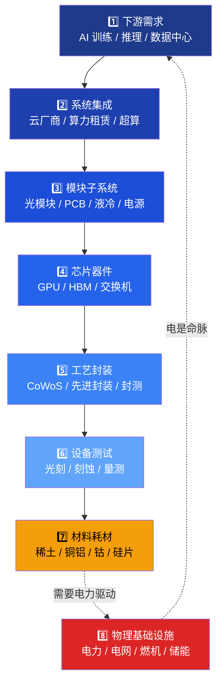

```mermaid
flowchart TB
    L1["1️⃣ 下游需求<br/>AI 训练 / 推理 / 数据中心"]
    L2["2️⃣ 系统集成<br/>云厂商 / 算力租赁 / 超算"]
    L3["3️⃣ 模块子系统<br/>光模块 / PCB / 液冷 / 电源"]
    L4["4️⃣ 芯片器件<br/>GPU / HBM / 交换机"]
    L5["5️⃣ 工艺封装<br/>CoWoS / 先进封装 / 封测"]
    L6["6️⃣ 设备测试<br/>光刻 / 刻蚀 / 量测"]
    L7["7️⃣ 材料耗材<br/>稀土 / 铜铝 / 钴 / 硅片"]
    L8["8️⃣ 物理基础设施<br/>电力 / 电网 / 燃机 / 储能"]

    L1 --> L2 --> L3 --> L4 --> L5 --> L6 --> L7
    L7 -.需要电力驱动.-> L8
    L8 -.电是命脉.-> L1

    style L1 fill:#1e3a8a,color:#fff
    style L2 fill:#1e40af,color:#fff
    style L3 fill:#1d4ed8,color:#fff
    style L4 fill:#2563eb,color:#fff
    style L5 fill:#3b82f6,color:#fff
    style L6 fill:#60a5fa,color:#fff
    style L7 fill:#f59e0b,color:#000
    style L8 fill:#dc2626,color:#fff
```

**红色 = 大摩闭门会强调的"被忽视的卡点层级"**
**橙色 = 同样被忽视但有强周期性的材料层**
