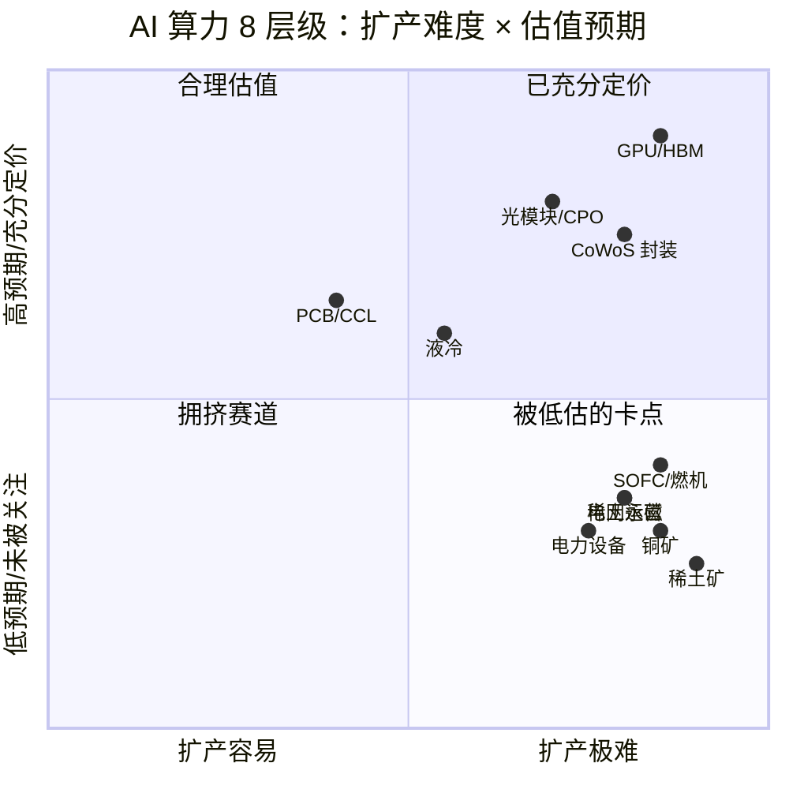

```mermaid
quadrantChart
    title AI 算力 8 层级：扩产难度 × 估值预期
    x-axis "扩产容易" --> "扩产极难"
    y-axis "低预期/未被关注" --> "高预期/充分定价"
    quadrant-1 "已充分定价"
    quadrant-2 "合理估值"
    quadrant-3 "拥挤赛道"
    quadrant-4 "被低估的卡点"
    "GPU/HBM": [0.85, 0.90]
    "CoWoS 封装": [0.80, 0.75]
    "光模块/CPO": [0.70, 0.80]
    "PCB/CCL": [0.40, 0.65]
    "液冷": [0.55, 0.60]
    "稀土永磁": [0.80, 0.35]
    "电力设备": [0.75, 0.30]
    "稀土矿": [0.90, 0.25]
    "铜矿": [0.85, 0.30]
    "SOFC/燃机": [0.85, 0.40]
    "电网运营": [0.80, 0.35]
```

**第四象限（高难度 + 低预期）= Serenity 找出的"被低估的最硬资产"**
