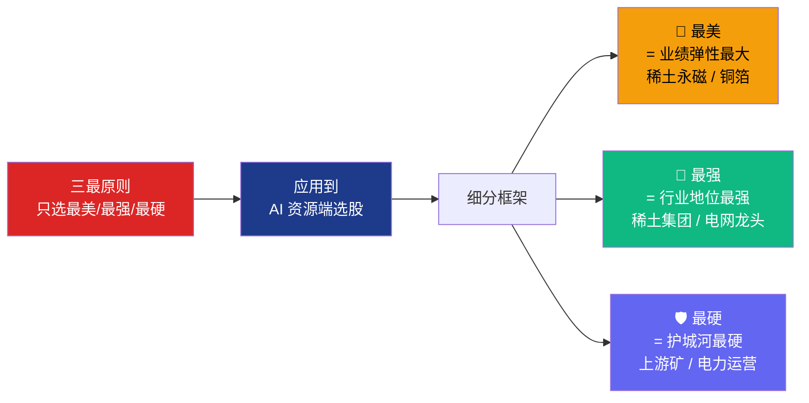

```mermaid
flowchart LR
    A[三最原则<br/>只选最美/最强/最硬]
    B[应用到<br/>AI 资源端选股]
    C[细分框架]
    
    A --> B
    B --> C
    
    C --> C1["🌟 最美<br/>= 业绩弹性最大<br/>稀土永磁 / 铜箔"]
    C --> C2["💪 最强<br/>= 行业地位最强<br/>稀土集团 / 电网龙头"]
    C --> C3["🛡️ 最硬<br/>= 护城河最硬<br/>上游矿 / 电力运营"]

    style A fill:#dc2626,color:#fff
    style B fill:#1e3a8a,color:#fff
    style C1 fill:#f59e0b,color:#000
    style C2 fill:#10b981,color:#fff
    style C3 fill:#6366f1,color:#fff
```

**zettaranc 框架："底仓守信仰（最硬），动态仓守纪律（最美最强）"**
